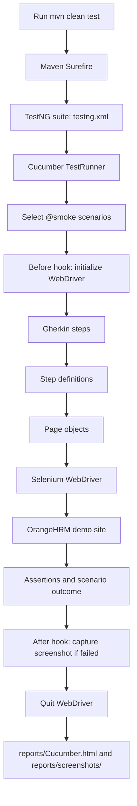
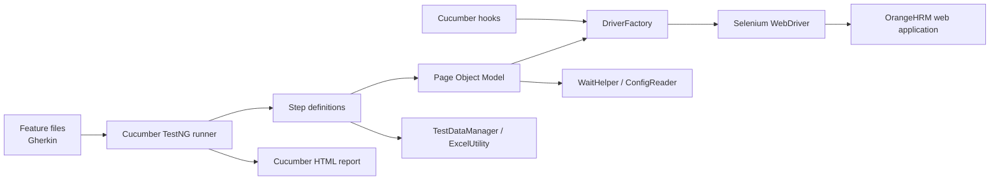

<div align="center">

# 🧪 Enterprise BDD Automation Suite

### Behavior-driven UI automation for OrangeHRM

[](https://www.oracle.com/java/)
[](https://www.selenium.dev/)
[](https://cucumber.io/)
[](https://testng.org/)
[](https://maven.apache.org/)

**Readable Gherkin scenarios · Page Object Model · Selenium WebDriver · HTML test report**

</div>

---

## 📌 Overview

This repository contains a Java-based browser automation framework for the [OrangeHRM demo application](https://opensource-demo.orangehrmlive.com/). Tests are written as Cucumber feature scenarios and executed with TestNG. Selenium drives the browser, page objects encapsulate UI interactions, and Excel workbooks provide employee and candidate test data.

The checked-in runner currently selects scenarios tagged `@smoke` and generates a Cucumber HTML report at `reports/Cucumber.html`. At present, the employee scenario is the only scenario tagged `@smoke`.

> **Demo environment:** These tests interact with a public demo site. Its availability, data state, and behavior are outside this repository's control. Use only non-sensitive test data.

## ✨ Features

- 🥒 **BDD scenarios** in Gherkin for login, employee, and candidate workflows.
- 🧱 **Page Object Model** to keep UI locators and interactions separate from step definitions.
- 🌐 **Browser selection** for Chrome, Firefox, or Edge, with optional headless mode.
- 📊 **Excel-driven test data** for employee and candidate flows.
- ⏱️ **Explicit and implicit waits** configured through project properties.
- 📄 **Cucumber HTML report** for scenario results.
- 📸 **Failure screenshots** captured by the Cucumber `@After` hook and saved under `reports/screenshots/` with a scenario-based name and timestamp.
- 🔐 **Environment-based login credentials** loaded from a local `.env` file.

## 🧰 Technology stack

| Area | Technology |
|---|---|
| Language | Java 21 |
| Build | Maven |
| Browser automation | Selenium WebDriver 4.35 |
| BDD | Cucumber 7.23 (Java + TestNG) |
| Test assertions / suite | TestNG 7.11 |
| Spreadsheet data | Apache POI 5.4 |
| Reporting | Cucumber HTML plugin |
| Logging dependencies | Log4j2 |

## 🗂️ Project layout

```text
.
├── pom.xml
├── testng.xml
├── reports/
│   ├── Cucumber.html                 # Generated Cucumber report (after a run)
│   └── screenshots/                  # Timestamped screenshots for failed scenarios
├── UserNotes/                         # Notes on hooks and the TestNG runner
└── src/test/
    ├── java/
    │   ├── hooks/                    # Cucumber setup and teardown
    │   ├── pages/                    # Page objects and UI actions
    │   ├── runners/                  # Cucumber + TestNG runner
    │   ├── stepdefinations/          # Gherkin step implementations
    │   └── utils/                    # Driver, config, waits, Excel, screenshots
    └── resources/
        ├── config/config.properties  # Environment, browser, waits
        ├── features/                 # Login, Employee, Candidate scenarios
        └── testData/                 # OrangeHRM Excel test data
```

> The package directory is spelled `stepdefinations` in the source tree; the Cucumber runner uses that same package name as its glue path.

## 🚀 Getting started

### Prerequisites

- JDK 21
- Apache Maven 3.8+
- A supported browser (Chrome, Firefox, or Microsoft Edge) installed locally
- Network access to the OrangeHRM demo site

Selenium 4 uses Selenium Manager to help resolve browser drivers when needed. A browser installation is still required.

### 1. Clone the repository

```bash
git clone https://github.com/Sameer-Programmer/2026_Enterprise_DEMO_BDD_Project.git
cd 2026_Enterprise_DEMO_BDD_Project
```

### 2. Configure demo login credentials

Create a `.env` file in the repository root. The file is ignored by Git.

```dotenv
DEV_USERNAME=your_demo_username
DEV_PASSWORD=your_demo_password
```

The login step reads these two keys through `dotenv-java`. Do not commit credentials. Obtain credentials from the demo environment or your team; do not put secrets in `config.properties` or feature files.

### 3. Configure browser and URL

Edit `src/test/resources/config/config.properties` as needed:

```properties
environment=dev
dev.url=https://opensource-demo.orangehrmlive.com/web/index.php/auth/login
qa.url=https://opensource-demo.orangehrmlive.com/web/index.php/auth/login
implicitWait=30
explicitWait=30
browser=chrome
headless=false
```

Supported `browser` values are `chrome`, `firefox`, and `edge`. Set `headless=true` for headless runs. The current login step reads `dev.url` directly; `environment` and `qa.url` are present in configuration but are not currently used to select the URL dynamically.

### 4. Run the suite

```bash
mvn clean test
```

Maven Surefire loads `testng.xml`, which invokes `runners.TestRunner`; the runner filters scenarios with `@smoke`. Currently, this runs the `Add a new employee` scenario. The login and candidate scenarios are tagged `@sanity` only, so they are not included by the current runner filter.

To run from an IDE, use the TestNG suite file `testng.xml` or the `TestRunner` class, and ensure the working directory is the repository root so that the relative config, `.env`, feature, and report paths resolve correctly.

## 🏗️ Jenkins status on `master`
This `master` branch does **not** currently contain a Jenkins pipeline file. The previously tracked empty `jenkinsfile` was removed in commit `570a081`, so a Jenkins job may still run if its pipeline is configured externally or sourced from another branch, but the pipeline definition is not versioned on `master`. The Jenkins pipeline code is available on `featureBranch3Jenkins` as `jenkinsFile`; merge or add that definition to `master` if you want the pipeline to be maintained in this branch.

## 🧭 Test coverage

| Feature file | Current scenarios | Main workflow |
|---|---:|---|
| `Login.feature` | 2 | Verify the login page; sign in and verify dashboard, then log out |
| `Employee.feature` | 1 | Sign in, add an employee, and verify the employee details page |
| `Candidate.feature` | 1 | Sign in, create a candidate, then search and verify the candidate |

There are four scenarios across the feature files: all four are tagged `@sanity`, and the employee scenario is additionally tagged `@smoke`. Because the runner filter is currently `@smoke`, only the employee scenario is selected by `mvn clean test`. Candidate and employee records are created in the shared demo application, so repeated runs may encounter pre-existing records or environment-specific validation behavior.

## 🔄 Execution flow



## 🏛️ Framework architecture



## 📈 Reports and artifacts

After a successful or failed test run, open **`reports/Cucumber.html`** in a browser to review scenario status and step details. The runner configures Cucumber's built-in HTML formatter (`html:reports/Cucumber.html`). The report is generated by the test run; rerunning tests replaces the report at that path. When a scenario fails, the `@After` hook also saves a timestamped PNG screenshot in **`reports/screenshots/`** before quitting the browser.

## ⚙️ Useful commands

```bash
mvn clean test                         # Run the configured @smoke suite (currently the employee scenario)
mvn -DskipTests test-compile            # Compile test sources without executing browser tests
```

## 🛠️ Troubleshooting

- **Missing `DEV_USERNAME` / `DEV_PASSWORD`:** verify the root `.env` file and exact key names. Do not commit it.
- **Browser or driver startup error:** confirm the chosen browser is installed and compatible; check network access if Selenium Manager needs to resolve a driver.
- **Config or feature file not found:** run Maven from the repository root.
- **Flaky demo-site behavior:** the public demo may be slow, unavailable, or have changing application data. Retry only after checking the site and test-data state.
- **Unexpected test selection:** the runner currently hard-codes `tags = "@smoke"`; update `src/test/java/runners/TestRunner.java` if you intend to change the suite filter. Add the desired tag to feature scenarios if they should be selected by that filter.

## 🤝 Contributing

1. Create or update a `.feature` file with readable, outcome-focused scenarios.
2. Implement the scenario steps and reuse or add page objects rather than placing locators in feature files.
3. Keep credentials out of source control; use local environment configuration.
4. Run `mvn clean test` and inspect the generated HTML report before opening a pull request.

---

<div align="center">

**Built for maintainable, readable browser automation.**

</div>
