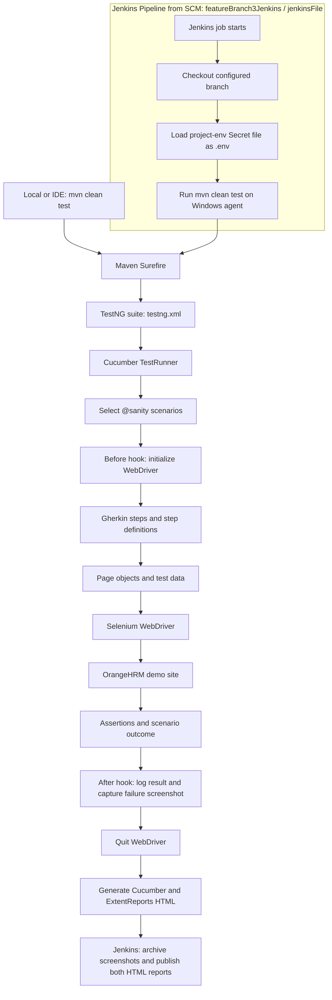
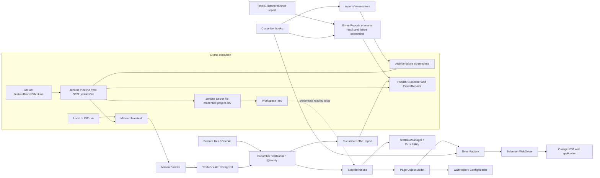

<div align="center">

# 🧪 Enterprise BDD Automation Suite

### Behavior-driven UI automation for OrangeHRM

[](https://www.oracle.com/java/)
[](https://www.selenium.dev/)
[](https://cucumber.io/)
[](https://testng.org/)
[](https://maven.apache.org/)

**Readable Gherkin scenarios · Page Object Model · Selenium WebDriver · HTML test report**

</div>

---

## 📌 Overview

This repository contains a Java-based browser automation framework for the [OrangeHRM demo application](https://opensource-demo.orangehrmlive.com/). Tests are written as Cucumber feature scenarios and executed with TestNG. Selenium drives the browser, page objects encapsulate UI interactions, and Excel workbooks provide employee and candidate test data.

The checked-in runner selects scenarios tagged `@sanity` and generates Cucumber and ExtentReports HTML reports at `reports/Cucumber.html` and `reports/ExtentReport.html`. All four scenarios in the feature files currently carry the `@sanity` tag, so `mvn clean test` selects all four.

> **Demo environment:** These tests interact with a public demo site. Its availability, data state, and behavior are outside this repository's control. Use only non-sensitive test data.

## ✨ Features

- 🥒 **BDD scenarios** in Gherkin for login, employee, and candidate workflows.
- 🧱 **Page Object Model** to keep UI locators and interactions separate from step definitions.
- 🌐 **Browser selection** for Chrome, Firefox, or Edge, with optional headless mode.
- 📊 **Excel-driven test data** for employee and candidate flows.
- ⏱️ **Explicit and implicit waits** configured through project properties.
- 📄 **Cucumber and ExtentReports HTML reports** for scenario results.
- 🏗️ **Jenkins pipeline** for checkout, secure environment-file setup, test execution, and report/screenshot archiving.
- 📸 **Failure screenshots** saved under `reports/screenshots/` and linked from the ExtentReports entry for the failed scenario.
- 🔐 **Environment-based login credentials** loaded from a local `.env` file.

## 🧰 Technology stack

| Area | Technology |
|---|---|
| Language | Java 21 |
| Build | Maven |
| Browser automation | Selenium WebDriver 4.35 |
| BDD | Cucumber 7.23 (Java + TestNG) |
| Test assertions / suite | TestNG 7.11 |
| Spreadsheet data | Apache POI 5.4 |
| Reporting | Cucumber HTML plugin; ExtentReports Spark HTML report |
| Logging dependencies | Log4j2 |

## 🗂️ Project layout

```text
.
├── pom.xml
├── testng.xml
├── jenkinsFile                       # Jenkins pipeline (lowercase filename)
├── reports/
│   ├── Cucumber.html                 # Generated Cucumber report (after a run)
│   ├── ExtentReport.html             # Generated ExtentReports report (after a run)
│   └── screenshots/                  # Failure screenshots linked from ExtentReports
└── src/test/
    ├── java/
    │   ├── hooks/                    # Cucumber setup and teardown
    │   ├── listeners/                # TestNG listener that flushes ExtentReports
    │   ├── pages/                    # Page objects and UI actions
    │   ├── runners/                  # Cucumber + TestNG runner
    │   ├── stepdefinations/          # Gherkin step implementations
    │   └── utils/                    # Driver, config, waits, Excel, screenshots, reporting
    └── resources/
        ├── config/config.properties  # Environment, browser, waits
        ├── features/                 # Login, Employee, Candidate scenarios
        └── testData/                 # OrangeHRM Excel test data
```

> The package directory is spelled `stepdefinations` in the source tree; the Cucumber runner uses that same package name as its glue path.

## 🚀 Getting started

### Prerequisites

- JDK 21
- Apache Maven 3.8+
- A supported browser (Chrome, Firefox, or Microsoft Edge) installed locally
- Network access to the OrangeHRM demo site

Selenium 4 uses Selenium Manager to help resolve browser drivers when needed. A browser installation is still required.

### 1. Clone the repository

```bash
git clone https://github.com/Sameer-Programmer/2026_Enterprise_DEMO_BDD_Project.git
cd 2026_Enterprise_DEMO_BDD_Project
```

### 2. Configure demo login credentials

Create a `.env` file in the repository root. The file is ignored by Git.

```dotenv
DEV_USERNAME=your_demo_username
DEV_PASSWORD=your_demo_password
```

The login step reads these two keys through `dotenv-java`. Do not commit credentials. Obtain credentials from the demo environment or your team; do not put secrets in `config.properties` or feature files.

### 3. Configure browser and URL

Edit `src/test/resources/config/config.properties` as needed:

```properties
environment=dev
dev.url=https://opensource-demo.orangehrmlive.com/web/index.php/auth/login
qa.url=https://opensource-demo.orangehrmlive.com/web/index.php/auth/login
implicitWait=30
explicitWait=30
browser=chrome
headless=false
```

Supported `browser` values are `chrome`, `firefox`, and `edge`. Set `headless=true` for headless runs. The current login step reads `dev.url` directly; `environment` and `qa.url` are present in configuration but are not currently used to select the URL dynamically.

### 4. Run the suite

```bash
mvn clean test
```

Maven Surefire loads `testng.xml`, which invokes `runners.TestRunner`; the runner filters scenarios with `@sanity`. All four scenarios currently have this tag, so the run includes both login scenarios, employee creation, and candidate creation/search.

To run from an IDE, use the TestNG suite file `testng.xml` or the `TestRunner` class, and ensure the working directory is the repository root so that the relative config, `.env`, feature, and report paths resolve correctly.

### Jenkins pipeline
The root-level **`jenkinsFile`** (lowercase `j`, uppercase `F`) defines the Jenkins pipeline on `featureBranch3Jenkins`. The job is configured as a Pipeline job that loads this file from source control.

#### Jenkins job configuration
1. In Jenkins, select **New Item**, enter a job name, choose **Pipeline**, and select **OK**.
2. Under **Pipeline**, set **Definition** to **Pipeline script from SCM**, **SCM** to **Git**, and **Repository URL** to [`https://github.com/Sameer-Programmer/2026_Enterprise_DEMO_BDD_Project`](https://github.com/Sameer-Programmer/2026_Enterprise_DEMO_BDD_Project).
3. Set **Branches to build** to `*/featureBranch3Jenkins` and **Script Path** to `jenkinsFile`. Preserve the exact capitalization; the path is not the conventional `Jenkinsfile`.
4. Save the job. If the repository requires authentication, select the appropriate Jenkins Git credentials.

#### Agent, credentials, and plugins
- The pipeline uses Windows `bat` commands (`copy` and `mvn`), so it must run on a Windows Jenkins agent with JDK 21, Maven, a supported browser such as Chrome, and access to the OrangeHRM demo site. With multiple agents, ensure the job is restricted to or otherwise scheduled on a Windows node.
- Add a Jenkins **Secret file** credential with ID **`project-env`**. The file should define `DEV_USERNAME` and `DEV_PASSWORD`; the pipeline copies it into the workspace as `.env`. Never commit this file or the credentials.
- Install the Jenkins **HTML Publisher** plugin so the Cucumber and ExtentReports reports can be published.

#### What the pipeline does
The pipeline checks out the selected SCM branch, writes the `project-env` Secret file to `.env`, and runs **`mvn clean test`**. Maven Surefire loads `testng.xml` and runs the Cucumber/TestNG runner, which currently selects the four `@sanity` scenarios. In the `post` section, Jenkins archives files under `reports/screenshots/` and publishes `reports/Cucumber.html` and `reports/ExtentReport.html`, even when the test stage fails. The pipeline prints a success or failure message based on the build result.

To run manually, open the job and choose **Build Now**. Open that build's **Console Output** to follow checkout, credential setup, test execution, and report publication. Jenkins checks out the configured branch at build time, so commit and push changes to `featureBranch3Jenkins` before building. A GitHub webhook or other automatic trigger can be configured separately; it is not configured by this pipeline file itself.

## 🧭 Test coverage

| Feature file | Current scenarios | Main workflow |
|---|---:|---|
| `Login.feature` | 2 | Verify the login page; sign in and verify dashboard, then log out |
| `Employee.feature` | 1 | Sign in, add an employee, and verify the employee details page |
| `Candidate.feature` | 1 | Sign in, create a candidate, then search and verify the candidate |

All four scenarios are tagged `@sanity`, matching the runner filter, so all four are selected by `mvn clean test`. Candidate and employee records are created in the shared demo application, so repeated runs may encounter pre-existing records or environment-specific validation behavior.

## 🔄 Execution flow


## 🏛️ Framework architecture


## 📈 Reports and artifacts

After a test run, open **`reports/Cucumber.html`** for Cucumber scenario status and step details, or **`reports/ExtentReport.html`** for the ExtentReports execution report. The TestNG listener flushes the ExtentReports output when the suite finishes. Both reports are regenerated at their respective paths on subsequent runs. When a scenario fails, the Cucumber `@After` hook saves a timestamped PNG screenshot in **`reports/screenshots/`** and adds it to the failed scenario entry in the ExtentReports report.

## ⚙️ Useful commands

```bash
mvn clean test                         # Run all scenarios tagged @sanity (currently four)
mvn -DskipTests test-compile            # Compile test sources without executing browser tests
```

## 🛠️ Troubleshooting

- **Missing `DEV_USERNAME` / `DEV_PASSWORD`:** verify the root `.env` file and exact key names. Do not commit it.
- **Browser or driver startup error:** confirm the chosen browser is installed and compatible; check network access if Selenium Manager needs to resolve a driver.
- **Config or feature file not found:** run Maven from the repository root.
- **Flaky demo-site behavior:** the public demo may be slow, unavailable, or have changing application data. Retry only after checking the site and test-data state.
- **Unexpected test selection:** the runner currently hard-codes `tags = "@sanity"`; update `src/test/java/runners/TestRunner.java` if you intend to change the suite filter. Add the desired tag to feature scenarios if they should be selected by that filter.

## 🤝 Contributing

1. Create or update a `.feature` file with readable, outcome-focused scenarios.
2. Implement the scenario steps and reuse or add page objects rather than placing locators in feature files.
3. Keep credentials out of source control; use local environment configuration.
4. Run `mvn clean test` and inspect `reports/Cucumber.html` and `reports/ExtentReport.html` before opening a pull request.

---

<div align="center">

**Built for maintainable, readable browser automation.**

</div>
